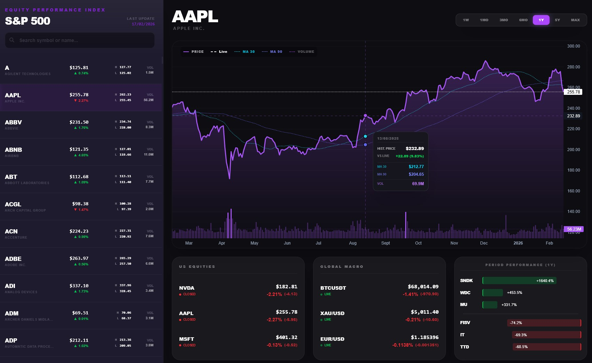
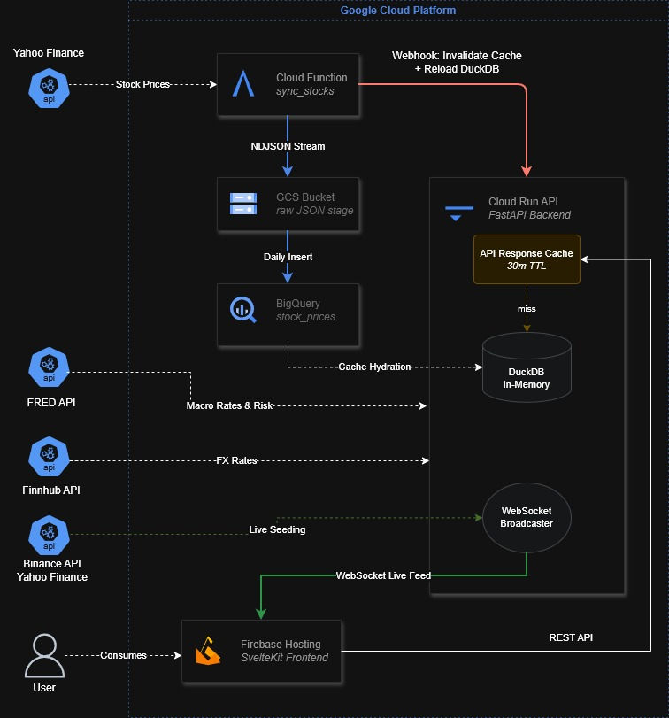

# Equity Performance Index Dashboard

high-performance financial dashboard deployed on Google Cloud Platform using SvelteKit, FastAPI, and BigQuery, using GCS-staged ingestion and DuckDB cache hydration to deliver live market data feeds and real-time price updates via WebSockets and Firebase.

## Live Dashboard
The dashboard provides an interface for tracking S&P 500 performance, technical indicators (MA30/MA90), and global macro assets.



## System Architecture
The application is built using a cloud-native stack focusing on low-latency data delivery and cost-efficient scaling.



### Core Components

#### 1. Data Ingestion & Persistence
* **Daily Fetch**: A Python-based Cloud Function (`sync_stocks`) performs daily EOD data retrieval from the Yahoo Finance API.
* **Staging & Audit**: Data is first streamed as NDJSON to a Google Cloud Storage (GCS) bucket, serving as an immutable raw data lake.
* **BigQuery Data Warehouse**: A daily insert job moves staged data from GCS into BigQuery (`stock_prices`) for long-term analytical storage.

#### 2. Event-Driven Orchestration
* **Async Webhook Trigger**: Upon successful BigQuery ingestion, the Cloud Function fires an asynchronous webhook to the backend API. This pattern decouples the ingestion pipeline from the application layer.
* **Cache Hydration**: The backend receives the trigger and initiates an internal background task to pull fresh data from BigQuery into a high-speed DuckDB In-Memory cache.

#### 3. Real-Time Presentation Layer
* **Cloud Run API**: A FastAPI backend hosted on Cloud Run (with dedicated CPU allocation) handles all RESTful requests and WebSocket management.
* **Live Seeding**: The backend seeds initial price points from Binance and Yahoo Finance APIs to establish market baselines.
* **WebSocket Broadcaster**: A persistent WSS (WebSocket Secure) feed pushes real-time ticks to the frontend, ensuring a reactive user experience without constant database polling.
* **Firebase Hosting**: The SvelteKit frontend is deployed via Firebase, providing a fast and responsive interface that consumes data through both RESTful snapshots and live WebSocket streams.

## Project Structure

```text
EXCHANGE_GCP/
├── backend/            # FastAPI, DuckDB, WebSocket Broadcaster
├── cloud_function/     # Data ingestion and BQ/GCS sync logic
├── frontend/           # SvelteKit Dashboard (hosted on Firebase)
└── docs/               # Architecture diagrams and screenshots
```

## Technical Specifications
* **Cache Hydration**: Minimizes BigQuery costs and latency by serving active data from an in-memory DuckDB instance.

* **SvelteKit Reactivity**: Leveraging Svelte's compiler-first approach to surgically update the DOM when WebSocket ticks arrive. This avoids the heavy overhead of a Virtual DOM, allowing for high-frequency UI updates (flickering price changes) with minimal CPU usage.

* **Global Edge Distribution**: By using Firebase Hosting, the application benefits from automatic SSL, compression (Brotli/Gzip), and a global CDN. This ensures the initial consumption is extremely fast.

* **NDJSON Streaming**: Ensures memory-efficient data transfers between cloud services.

* **Decoupled Architecture**: Ingestion, Storage, and Serving layers operate independently, increasing system resilience.

* **Hybrid Data Model**: Combines accurate EOD historical data from BigQuery with live price action.