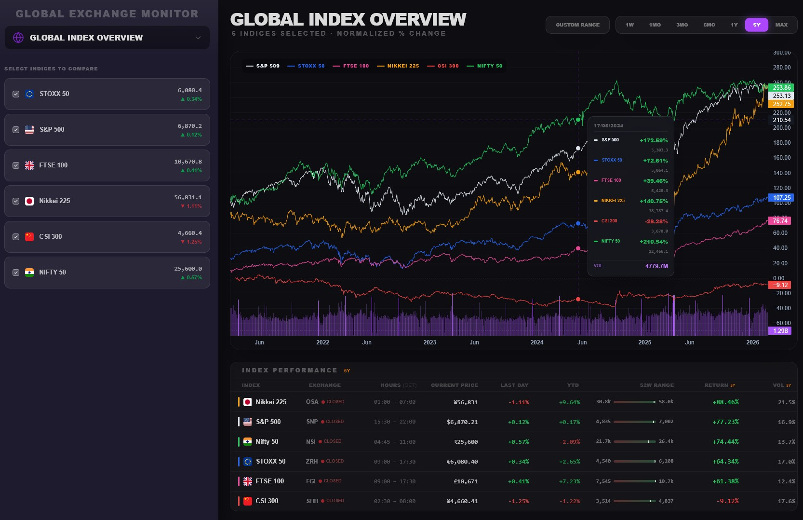
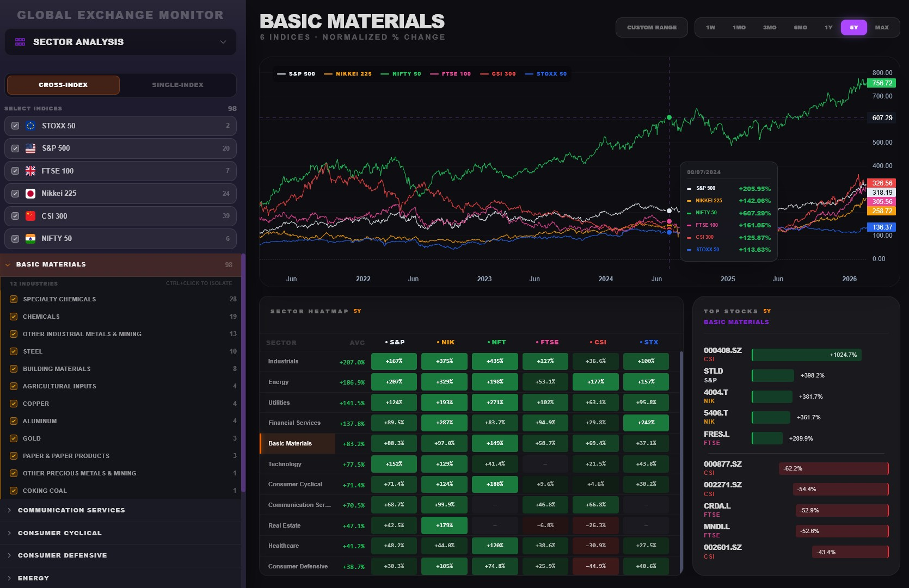
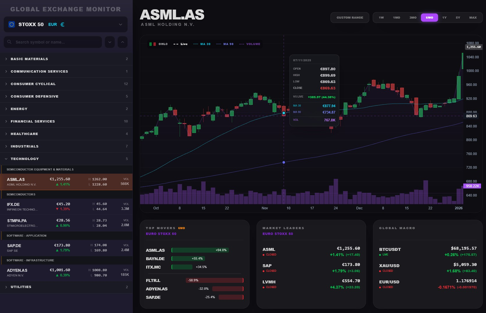

# Global Exchange Monitor

A real-time global stock market dashboard tracking 6 major indices — S&P 500, EURO STOXX 50, FTSE 100, Nikkei 225, CSI 300, and Nifty 50 — with sector analysis, cross-index comparison, and live price feeds.

---

## Screenshots

### Global Index Overview

Normalized % change comparison across all 6 indices with interactive crosshair tooltip, volume chart, and a sortable performance table showing current price, YTD return, 52-week range, and period return.

### Sector Analysis

Cross-index sector performance with a heatmap, industry breakdown, and top/bottom movers — filterable by index, industry, and time period.

### Stock Page

Per-stock OHLCV candlestick chart with MA30/MA90 overlays, live price feed, top movers panel, market leaders, and global macro indicators.

---

## Architecture

### How it works

**Ingestion** — A Cloud Function (`sync_stocks`) runs daily, fetching OHLCV data from Yahoo Finance for all index constituents. It performs per-symbol gap detection using exchange calendars (XNYS, XFRA, XLON, XTKS, XSHG, XBOM) to catch interior gaps, not just trailing ones. Data flows: Yahoo Finance → GCS (raw NDJSON staging) → BigQuery (persistent warehouse).

**Backend** — A FastAPI app on Cloud Run hydrates per-index DuckDB in-memory tables from BigQuery on startup, with lazy loading per index. An API response cache (30min TTL) sits in front of DuckDB for hot-path queries. When the Cloud Function completes a sync, it fires a webhook that invalidates the cache and triggers a background DuckDB reload — non-blocking, so stale data is served during the refresh window. All SQL queries are extracted into standalone `.sql` files and loaded with a caching loader.

**Real-time feed** — A background task polls Binance and Yahoo Finance every 10 seconds and broadcasts live prices via WebSocket to all connected clients.

**Frontend** — SvelteKit app hosted on Firebase Hosting. Connects to the REST API for historical data and opens a WebSocket for live price updates.

### Stack

| Layer | Technology |
|---|---|
| Frontend | SvelteKit, TailwindCSS, Lightweight Charts |
| Backend | FastAPI, DuckDB (in-memory), Python |
| Warehouse | BigQuery |
| Ingestion | Google Cloud Functions, yfinance, exchange-calendars |
| Staging | Google Cloud Storage |
| Hosting | Firebase Hosting (frontend), Cloud Run (backend) |
| Real-time | WebSocket, Binance API, Yahoo Finance |

---

## Features

### Global Index Overview
- Normalized % change chart across up to 6 indices simultaneously with unified timeline and forward-fill for sparse series
- Interactive crosshair tooltip showing price, % change, and volume per index at any date
- Volume bar chart synchronized with the main chart
- Index performance table: current price, daily change, YTD, 52-week range, period return, volume
- Period selector: 1W · 1MO · 3MO · 6MO · 1Y · 5Y · MAX · Custom Range

### Sector Analysis
- **Cross-index mode** — track one sector across all 6 indices on a single normalized chart
- **Single-index mode** — compare multiple sectors within one index
- Per-stock normalization + unified timeline + forward-fill prevents chart spikes from IPOs, delistings, and trading calendar mismatches
- **Sector Heatmap** — all sectors × all indices, colour-coded by return magnitude, with cross-index average column
- **Industry breakdown** — drill into sub-industries within any sector per index
- **Top/bottom movers** — best and worst performing stocks within the selected sector and period
- Sidebar industry filter with per-index stock counts and ctrl+click to isolate
- Period selector with custom date range support

### Stock Page
- OHLCV candlestick chart with MA30 and MA90 overlays
- Live price line (WebSocket) shown alongside historical candles with VS LIVE delta in tooltip
- Sector/industry browse tree in sidebar with stock count per node
- Symbol search
- **Top Movers** panel — period return bar chart for top and bottom performers in the index
- **Market Leaders** panel — real-time price and daily change for index blue chips
- **Global Macro** panel — live BTC/USD, XAU/USD, EUR/USD via WebSocket