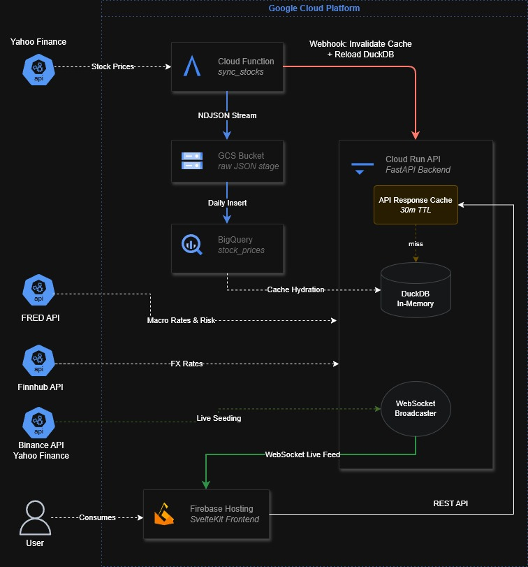

# Global Exchange Monitor

Real-time financial dashboard tracking 6 major stock indices across 4 continents. Built on Google Cloud Platform with SvelteKit, FastAPI, BigQuery, and DuckDB.

## Dashboard Modes

- **Index Benchmarks** — Multi-index comparison, cross-index correlation heatmap, news feed, economic calendar
- **Sector Analysis** — Cross-index or single-index sector rotation, industry breakdown with donut charts, top/bottom stock rankings per sector
- **Stock Browser** — OHLCV candlestick chart with MA overlays, technical indicators (RSI, MACD, Bollinger, ATR, Beta), top movers, most active by volume
- **Macro Context** — Risk dashboard, BTC/Gold/EUR-USD live tickers, FX rates, macro watchlist, economic calendar

## Architecture



### Data Pipeline

1. **Ingestion** — Cloud Function (`sync_stocks`) runs daily via Cloud Scheduler, fetching EOD prices from Yahoo Finance with exchange-calendar-aware gap detection. Data is archived as NDJSON in GCS and appended to BigQuery.
2. **Cache Hydration** — On ingestion completion, a webhook triggers the backend to pull fresh data from BigQuery into an in-memory DuckDB instance. Two-phase startup loads priority indices first (STOXX 50, S&P 500), then remaining indices in parallel.
3. **Serving** — FastAPI on Cloud Run serves 40+ REST endpoints with per-endpoint TTL caching, singleflight to prevent stampedes, and SWR (stale-while-revalidate) headers. A WebSocket feed broadcasts live BTC and macro instrument ticks.
4. **Presentation** — SvelteKit SPA on Firebase Hosting consumes REST snapshots and WebSocket streams. Svelte 5 runes enable surgical DOM updates for real-time price flickers.

### Key Technical Decisions

- **DuckDB in-memory** — Sub-millisecond OLAP queries without BigQuery costs on every request. RWLock serializes concurrent reads/writes.
- **Circuit breakers** — Per-provider (Binance, Finnhub, FRED, Frankfurter) with configurable failure thresholds and recovery timeouts.
- **Precomputed sector series** — Forward-filled sector/industry time series stored in DuckDB enable instant switching between indices.
- **Hybrid data model** — Accurate EOD historical data from BigQuery combined with live intraday ticks from Binance and Yahoo Finance.

## Project Structure

```
EXCHANGE_GCP_DEV/
├── backend/                # FastAPI + DuckDB + WebSocket broadcaster
│   ├── main.py             # API server (endpoints, startup, feeds)
│   ├── index_config.py     # Index configuration loader
│   ├── sql/                # 46 SQL template files
│   └── config/             # indices.json (synced copy)
├── ingestion/              # Cloud Function — daily EOD sync
│   └── main.py             # Gap detection, download, BQ load, notify
├── frontend/               # SvelteKit 5 + Tailwind v4 dashboard
│   ├── src/lib/stores.js   # Global state + data loaders (SWR cache)
│   ├── src/lib/styles/     # Design tokens, themes (dark/light), responsive
│   ├── src/lib/components/ # 30+ panel components + 13 UI primitives
│   └── src/routes/         # Single-page dashboard orchestrator
├── config/
│   └── indices.json        # Single source of truth for all index metadata
└── docs/                   # Architecture diagram
```


Required environment variables for the backend:

| Variable | Description |
|---|---|
| `PROJECT_ID` | GCP project ID |
| `FINNHUB_API_KEY` | Finnhub API key (news, company data) |
| `FRED_API_KEY` | FRED API key (macro indicators) |

## Tech Stack

| Layer | Technology |
|---|---|
| Frontend | SvelteKit 2, Svelte 5, Tailwind CSS v4, lightweight-charts, ECharts |
| Backend | FastAPI, DuckDB, pandas, httpx, WebSockets |
| Data | BigQuery, Cloud Storage (NDJSON archive), Yahoo Finance, Binance |
| Infra | Cloud Run, Cloud Functions, Cloud Scheduler, Firebase Hosting |
| Design | Geist + Geist Mono fonts, dark/light themes, 7-breakpoint responsive grid |
